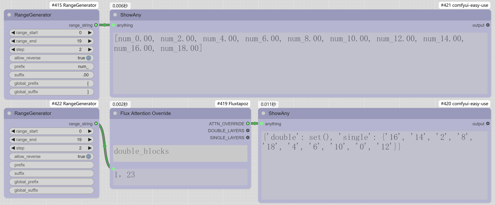

# ComfyUI_RangeGenerator

一个简洁实用的ComfyUI插件，提供范围数列生成功能。

## 节点预览

## 功能概述

范围数列生成器（RangeGenerator）节点能够根据指定的起始值、结束值和步长，生成格式化的数值序列。可以用于为接受各种格式数列的节点提供快速且可控的参数输入，比如Flux_Tapoz插件的Flux Attention Override节点，利用该节点可以快速测试各种参数输入的生成效果。

## 安装方法

1. 将此仓库克隆或下载到ComfyUI的`custom_nodes`目录
2. 重启ComfyUI

## 使用指南

1. 在节点浏览器中搜索"范围数列生成器"或"RangeGenerator"
2. 添加节点到工作流
3. 配置参数：
   - `range_start`：数列的起始值
   - `range_end`：数列的结束值
   - `step`：相邻数值之间的间隔
   - `allow_reverse`：当结束值小于起始值时，是否允许生成逆向数列
   - `prefix`：为每个数值添加的前缀
   - `suffix`：为每个数值添加的后缀
   - `global_prefix`：为整个数列添加的前缀
   - `global_suffix`：为整个数列添加的后缀

节点会生成格式为"global_prefix + prefix1suffix, prefix2suffix, ... + global_suffix"的字符串输出，可直接连接到其他接受此类格式的节点。

## 许可证

MIT 